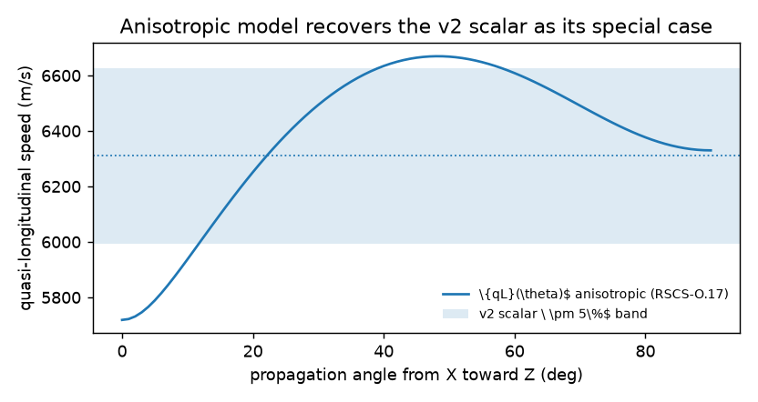
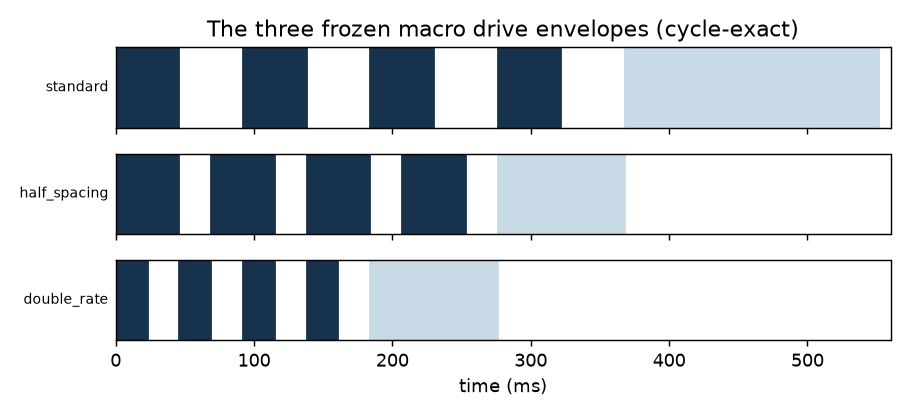

# RGCS — Resonant Geometry Computational System

[](https://github.com/andrew867/rgcs/actions/workflows/ci.yml)
[](LICENSE)
[](https://doi.org/10.5281/zenodo.21387947)

**Current release: [v4.8.0](https://github.com/andrew867/rgcs/releases/tag/v4.8.0)**
· includes RSCS 2.0 (capability-aware multiphysics) on the RSCS 1.0
typed-mathematics layer · MIT license · Author: Andrew Green
Frozen history: v2.0.0 (`archive/v2.0.0/`), v3.0.x, v4.0.0, v4.1.x — tags and
records never modified. The DOI badge above is the latest **minted**
DOI (v3.0.1); the v4.x Zenodo records are pending human verification
(see Citing).

RGCS is a **reproducible research framework** for studying acoustic/mechanical
resonance and phase coherence in engineered quartz geometries: a typed,
provenance-checked mathematics library, a validated anisotropic FEM +
piezoelectric solver stack, a capability firewall that refuses to fabricate
results for unimplemented mechanisms, an uncertainty-aware Eye Consensus
diagnostic engine, reduced-order reference systems for non-quartz physics,
a desktop workbench, safety-bounded experiment schemas, and fully generated
manuscripts — plus a pre-registered falsification plan for every hypothesis
the project holds.

## RGCS v4.1 at a glance

- **All results are computational. No experimental confirmation exists.**
- Validated quartz core (CORE_VALIDATED): anisotropic elasticity, modal
  + static FEM, piezoelectric coupling, dielectric response, photoelastic
  and birefringent optics, mechanical torsion/circulation diagnostics,
  calibration with uncertainty ([user guide](docs/USER_GUIDE_V4.md),
  [v4.1 release notes](docs/RELEASE_NOTES_V4_1.md)).
- **Eye Consensus verdict (canonical 110 mm crystal):**
  `UNCERTAINTY_OVERLAPS_CONVENTIONAL_NODE`. The candidate at
  (−0.295, −0.205, 102.240) mm sits **3.906 mm** from the nearest
  conventional station (−0.447, 0.774, 106.018) mm; the localization
  halfwidth is 3.08 mm (mesh-resolution dominated; convergence shift
  0.353 mm, material-draw cloud rms 0.032 mm). The implemented
  conventional model **may** explain the result within current
  uncertainty — it is **not established that it does**; finer mesh
  resolution is the discriminating next computation. (v4.1 removed the
  old 4 mm proximity rule, defect V4C-D-001; the v4.0.0 records are
  frozen history.)
- **Capability firewall:** unimplemented quartz mechanisms (magnetic
  order, magnons, excitons, ferrotoroidic/IOME, dynamic magnetoelectric
  tensors, metacrystal statistics, microscopic tunnelling, chiral-phonon
  Zeeman, spacetime torsion) return typed
  `MECHANISM_NOT_IMPLEMENTED_FOR_MATERIAL` results — never numeric
  zeros, and **never a claim of physical nonexistence**
  ([binding scope statement](docs/v4/WHAT_THIS_QUARTZ_MODEL_DOES_NOT_INCLUDE.md),
  [capability matrix](docs/v4/V4_MATERIAL_CAPABILITY_MATRIX.md)).
- **Separate reference systems** (REDUCED_ORDER_VALIDATED, never quartz):
  exciton-magnon, avoided crossings, dressed spin, chiral phonons,
  dynamic magnetoelectric response, metacrystal g2 transfer, LiNiPO4
  IOME, MnF2 annealing comparator, nonlinear AFM switching,
  phonon-controlled exchange. They are comparison systems and hypothesis
  generators — not evidence those mechanisms operate in the quartz
  specimen.
- **Quarantined source hypotheses:** FDT and source-lore material are
  import-firewalled SOURCE_HYPOTHESIS adapters with pre-registered
  falsification discriminators ([provenance](sources/registry/),
  [FDT adapter](docs/v4/V4_FDT_SOURCE_HYPOTHESIS_ADAPTER.md)).
- **Not implemented anywhere:** DFT, Bethe-Salpeter, ab-initio spin
  dynamics, QFT, microscopic QED/plasmonics, microscopic proton
  tunnelling, nonclassical photon-statistics generation, photon creation
  from classical boundary switching, or a complete microscopic
  explanation of Eye candidates.
- **Research expansion (v4.2.1):** the post-v4.1 backlog is translated
  into equations, protocols, controls, and honest statuses — see the
  [programme report](docs/v4/V4X_PROGRAMME_REPORT.md) and the
  [coverage ledger](docs/v4/V4X_COVERAGE_LEDGER.md). **268 items**
  (248 fixed + 20 found by the orphan sweep) each carry an owner,
  artifact, status, documentation, test-or-falsification, blocker, and
  next action, verified mechanically by gates G42A–G42G. The
  experimental campaigns are **protocols only**: no hardware was
  operated and no data was measured. The
  [consciousness lane](consciousness_lane/) is a separate, quarantined
  research programme whose records may never be used as evidence in
  quartz computation.
- **Eye refinement (v4.2.1) — resolved, and the answer changed.** A
  finer ladder (3.0/2.0/1.5 mm, 30 816 dof) puts the localization
  halfwidth (**1.803 mm**) below the candidate-station separation
  (**6.298 mm**) for the first time, so the comparison finally carries
  information: `NEAR_CONVENTIONAL_NODE_BUT_DISTINCT` — **the
  conventional model does not explain the candidate**. The candidate
  also **does not converge on the v4.1 coordinate**: its distance from
  (−0.295, −0.205, 102.240) mm *grows* with resolution (1.375 → 2.270 →
  2.476 mm), settling near (−0.048, −0.020, 99.78) mm. The v4.1 record
  is preserved unchanged (it faithfully records a ~4 mm-spacing
  computation); what changes is its interpretation — that coordinate was
  resolution-limited. Computational only; no measurement exists
  ([Eye refinement V5](docs/v4/EYE_REFINEMENT_V5.md)).
- **v4.2.1 is a completeness-audit release.** v4.2.0's "248/248
  coverage" verified that every ID had an owner *string* — it never
  checked that the work existed. Seven QA attacks succeeded against it:
  two workstreams were registries wearing an implementation's status,
  the orphan sweep had never run, and 47 required documents were
  missing. All eleven defects are closed with regression tests
  ([QA verdict](docs/v4/V4X_QA_FINAL_VERDICT.md),
  [defect register](docs/v4/V4X_DEFECT_REGISTER.md)).
- **Emergent resonator programme (v4.3.0):** a closed-loop resonator
  design→measure→trim→certify platform
  ([resonator_platform/](resonator_platform/)) whose every artifact is
  **synthetic and flagged so** — no hardware exists and every physical
  path refuses by capability gate; five 2026 papers as firewalled
  reference models; and the Eye **census correction**: the v4.1 and
  v4.2.1 coordinates are two resolution-dependent estimates of one
  apex feature, which has a symmetric family
  ([claim card v4](docs/v4/EYE_CLAIM_CARD.md),
  [platform](docs/v4/resonator/CLOSED_LOOP_PLATFORM.md)). Coverage
  288/288 verified mechanically.
- **Frequency-key instrument (v4.4.0):** an exact-arithmetic
  frequency-relation engine (a 4096×5 harmonic is not an 8×2560
  closure), a mechanism-first drive optimizer whose arithmetic
  coincidences score zero amplitude by construction, a fail-off
  ESP32-CYD instrument twin (arm leases, latched faults, hash-chained
  logs) with firmware source (NOT compiled — no toolchain/hardware),
  and six SYNTHETIC simulator demos
  ([fkey docs](docs/v4/fkey/FKEY_INSTRUMENT.md)). The specimen is an
  eBay listing; all six hypotheses are UNTESTED.
- **Status at the release commit (v4.5.0):** 1217 tests passed
  (1 archived-environment byte test deselected by policy D-V3-04);
  hosted CI 10/10 jobs green (Ubuntu/Windows/macOS); adversarial audit
  19/19 including the consciousness-lane quarantine check (G51);
  coverage gates G42A–G42G pass over 268 rows; proof bundle 115/115
  checksums ([proof bundle](proof_bundle_110mm/), regenerate with
  `python -m rscs2_core.proofbundle`). The v4.1.0 scientific baseline
  (`4c2a1cc`, 605 tests) is frozen and unchanged.
- **iGPU:** Intel Iris Xe (fp32) parity 3.4e-05 and i5-1135G7 CPU-CL
  (fp64) parity 1.8e-14, measured on real hardware at v4.0.0 and
  unchanged; CUDA remains interface-only (no hardware).

## Honest scope — read this first

**No RGCS hypothesis has been experimentally confirmed.** The repository
contains zero confirming measurements of real crystals. What it contains is
the machinery to test its 30 pre-registered claims honestly: every hypothesis
ships with an observable, matched controls, an uncertainty statement, and a
failure condition — several directional claims are pre-registered **nulls**
(the expected outcome is *no effect*). The project makes **no therapeutic,
medical, cosmological, or consciousness claims**, and a forbidden-vocabulary
lint enforces that in the test suite.

Every scientific statement in code, docs, UI, and manuscripts carries one of
five machine-checked labels (`docs/SCIENTIFIC_CLASSIFICATION_POLICY.md`):

| Label | Meaning |
|---|---|
| **Established** (EST) | textbook math/physics anyone can verify independently |
| **Derived** (DER) | computed within RGCS from stated inputs by stated math; inherits the weakest input label |
| **Hypothesis** (HYP) | a falsifiable RGCS conjecture; never presented as fact |
| **Source claim** (SRC) | an external source's statement, reported with provenance, not endorsed |
| **Engineering plan** (ENG) | unbuilt software/hardware design; never evidence |

A machine-enforced firewall rejects any Established/Derived output computed
from Hypothesis/Source/Engineering inputs.

## Architecture

```
┌─────────────────────────────────────────────────────────────────┐
│ rgcs_desktop      PySide6 workbench (13 panels) + headless,     │
│                   tested services (provenance graph, waveform/   │
│                   timing preview, phase-budget views)             │
├─────────────────────────────────────────────────────────────────┤
│ rgcs_core         crystal application: geometry, resonance       │
│                   ladders, coupled modes, anisotropy (Christoffel)│
│                   optics, timing/drive, experiments, crystal DB,  │
│                   FEA export — 61 frozen equations RGCS-M.1..61   │
├─────────────────────────────────────────────────────────────────┤
│ rscs_core         RSCS 1.0 typed framework: 17 coordinates +     │
│                   23 operators on declared manifolds, machine     │
│                   registry, classification firewall, embedding ι  │
├─────────────────────────────────────────────────────────────────┤
│ Conservative Extension Property (machine-tested, every commit):   │
│        O_RSCS(ι(x)) = ι(O_RGCS(x))  on the frozen v2 domain      │
├─────────────────────────────────────────────────────────────────┤
│ RGCS v2.0.0 — FROZEN  (tag v2.0.0, archive/v2.0.0/)              │
└─────────────────────────────────────────────────────────────────┘

experiments/   JSON schemas + validated example manifests (13 schemas)
manuscripts/   4 XeLaTeX manuscripts, every number generated from code
embedded/      HG Embedded OS contract (ESP32/CYD; ENG until built)
scad/          OpenSCAD CAD generators (v7 fixes the v6 D-02 defect)
docs/          full specification, decision log, QA and audit trail
release/       v3.0.0-rc1 artifacts, SHA256SUMS, provenance manifest
```

The layering rule: v3 never edits v2 — it reaches the frozen core only
through the embedding, and the Conservative Extension Property battery
proves the round trip on every test run.

## A taste of what's inside

The flagship v3 result — the v2 scalar wave-speed *hypothesis* resolved into
a measured-orientation anisotropic model that recovers the scalar as its
special case (its ±5 % band turns out to be the physical X–Z spread):



The three frozen macro drive envelopes, rendered by the same code the
desktop preview and firmware acceptance tests use (the source's ambiguous
"shorter by half" phrase is preserved as *two* distinctly named modes):



Desktop workbench screenshots will accompany the T2 panel tranche; until
then the headless services behind those panels are fully tested and their
outputs are what you see above.

## Quick start

Python ≥ 3.11 on Windows, Linux, or macOS (CI covers all three).

```bash
git clone https://github.com/andrew867/rgcs && cd rgcs
python -m pip install -e ".[dev]"
python -m pip install "scikit-fem>=10" meshio matplotlib gmsh   # v4 solver stack
python -m pytest -q --deselect tests/regression/test_generator_determinism.py::test_generator_deterministic
# expect: see docs/v4/RELEASE_METADATA.json, at the v4.8.0 release commit
```

The v4 CLI entry point is `rgcs-v4` (or `python -m rscs2_core.cli`):

```bash
rgcs-v4 capabilities material.alpha_quartz --check magnon_modes
#   -> NOT_APPLICABLE with reason_code MECHANISM_NOT_IMPLEMENTED_FOR_MATERIAL
rgcs-v4 modes ideal_n7 --n 12          # anisotropic modal solve (needs gmsh)
rgcs-v4 proof-bundle canonical-110     # the full reproducibility bundle
rgcs-v4 verify-checksums               # 115/115 expected
python tools/demo_v4.py --fast         # 10-step clean-workspace demo
```

Then try the library:

```python
from rscs_core.coupling import couple_modes
couple_modes([1000.0, 1000.0], [[0.0, 10.0], [10.0, 0.0]])
# hybrid frequencies 990/1010 Hz — the 2g splitting, anti-Hermitian K = i·2πg

from rgcs_core.anisotropy import axis_speeds
axis_speeds()["Z"]["v_quasi_long_m_s"]   # 6330 m/s = sqrt(c33/rho)
```

Desktop workbench: `pip install -e ".[desktop]"` then
`python -m rgcs_desktop` (or `--smoke-check` headless).
Validate experiment manifests: `python experiments/schemas/validate.py`.

## Build the manuscripts

```bash
python tools/make_v3_artifacts.py       # regenerate every table/figure
cd manuscripts/rscs_foundations
xelatex rscs_foundations.tex && bibtex rscs_foundations \
  && xelatex rscs_foundations.tex && xelatex rscs_foundations.tex
```

(Each manuscript directory has a `BUILD.md`; `latexmk -xelatex` works where
perl is available.) The v2 manuscript builds the same way in `manuscript/`.

## Publications

| Work | What it covers | Source |
|---|---|---|
| **RSCS Foundations** | the typed framework, conservative extension, coupling keystone | `manuscripts/rscs_foundations/` |
| **RGCS Crystal Application** | anisotropic propagation, node menu, optical probe layer | `manuscripts/rgcs_crystal_application/` |
| **Software & Hardware Roadmap** | platform layering, timing architecture, safety envelope, embedded contract | `manuscripts/software_hardware_plan/` |
| **Historical & Source Companion** | the source corpus in its own words, adaptations and binding exclusions | `manuscripts/historical_source_companion/` |
| RGCS v2 manuscript (28 pp.) | the frozen v2 system | `manuscript/rgcs_v2.pdf` |

Every numeric table, figure, and inline value in all five documents is
generated from the tested libraries at build time — no number is hand-typed.

## Lessons learned

- Independent QA is most valuable when it is allowed to overturn the
  project's own mathematics. A v2 review found an incorrect time-domain
  coupling map; fixing it (anti-Hermitian `K = i·2πg`) changed the physical
  interpretation and produced a permanent regression test.
- Provenance and classification matter as much as equations. Separating
  Established, Derived, Hypothesis, Source, and Engineering claims allowed
  historical material to inspire tests without becoming evidence by
  repetition — and a machine-enforced firewall keeps it that way.
- Historical or unconventional claims can often be translated into
  measurable variables without presuming they are true: "the eye" became an
  eight-definition node menu with failure conditions; "a single crystal
  tone" became a scalar wave speed that anisotropic modelling then explained.
- A resonant system cannot be characterized by geometry and nominal
  frequency alone: boundary conditions, anisotropy, mode overlap, phase,
  delay, damping, loading, uncertainty, and measurement fidelity all matter.
  The phase-at-coordinate model exists because commanded phase is never the
  phase at the crystal.
- Cross-platform numerical reproducibility requires declared environments
  plus tolerance-aware portability tests. Two of our "Windows defects"
  turned out to be an undeclared dependency; the third was a real
  path-separator bug. A two-OS CI matrix caught what code review had not.
- Frozen registries and conservative-extension tests made it possible to
  expand the framework without silently rewriting earlier results.
- Software and modelling advanced faster than the measurement programme.
  The project's strongest current output is a reproducible framework and
  falsification plan, not experimental confirmation — and every
  claim-bearing surface says so.
- Independent review, negative results, and explicit failure conditions
  strengthened rather than weakened the project.

Fuller engineering version: `docs/SOFTWARE_HARDWARE_ARCHITECTURE.md`.

## Roadmap

| Tranche | Content | Status |
|---|---|---|
| — | Green Linux CI run | **the only gate to final v3.0.0** |
| T2 | Desktop Qt panels over the tested headless services | contracts fixed |
| T3 | FEA import scripts, coupling-graph panel | scoped |
| T4 | HG Embedded OS firmware (BSP, timing service, self-test) | contract published |
| T5 | Timing hardware (TCXO/DDS/CPLD + interlocks) | ENG until measured |
| T6 | Latency-calibration campaign (unblocks phase claims, gate H-29) | pre-registered |
| — | Bench campaigns for claims H-20..H-30 | pre-registered |

## Limitations (honest list)

1. **No bench data: nothing physical is confirmed** (see Honest scope).
2. Eye localization is mesh-resolution dominated (±3.08 mm at shipped
   mesh levels): whether the 3.906 mm candidate/station separation is
   real structure or discretization is an OPEN question — finer meshes
   are the discriminating computation.
3. New-wave source papers (Toyoda, Schlauderer, Afanasiev, …) are
   registered metadata-only; numeric comparisons against their measured
   values are marked pending until full texts are supplied locally.
4. One inherited test is byte-exact only in the archived v2 reference
   environment (deselected everywhere per policy D-V3-04; a
   tolerance-aware equivalent runs on every platform).
5. v4-specific GUI views are staged past 4.1 (the CLI + offscreen
   rendering cover every function); desktop panels beyond the v3
   workbench, firmware, and hardware remain contracts.
6. No DFT/BSE/ab-initio/QFT/microscopic solvers anywhere; the metacrystal
   transfer is a declared reduced rule; optical walk-off is not modelled.

Full lists with evidence: [docs/RELEASE_NOTES_V4_1.md](docs/RELEASE_NOTES_V4_1.md),
`docs/v4/V4_WHAT_IS_NOT_MODELLED.md`, and the historical
`release/RELEASE_NOTES.md` / `docs/QA_REPORT_V3.md`.

## Contributing, support, and conduct

See [CONTRIBUTING.md](CONTRIBUTING.md), [SUPPORT.md](SUPPORT.md),
[CODE_OF_CONDUCT.md](CODE_OF_CONDUCT.md), [SECURITY.md](SECURITY.md),
[FAQ.md](FAQ.md), and — for the *why* behind the unusual discipline —
[DESIGN_PHILOSOPHY.md](DESIGN_PHILOSOPHY.md) and
[RESEARCH_HISTORY.md](RESEARCH_HISTORY.md).

## Citing

See [`CITATION.cff`](CITATION.cff) (GitHub renders a "Cite this repository"
button from it). Minted DOIs: 10.5281/zenodo.21387947 (v3.0.1 version DOI)
and 10.5281/zenodo.21387946 (concept DOI, always latest). **The v4.x
Zenodo records (v4.1.x, v4.2.0) are pending human
verification/publication** (see `docs/ZENODO_METADATA_V4.md`); their
version DOIs will be added to CITATION.cff in follow-up commits once
minted. Release provenance —
commit, environment, checksums, test evidence: the `PROVENANCE.json` and
`SHA256SUMS.txt` assets on each GitHub release.

## Acknowledgements

- The historical crystal-practice corpus and personal working logs that
  posed the questions this programme formalizes (preserved, with authorship
  and original wording, in the Historical & Source Companion).
- K. Arisaka (UCLA) for the publicly presented NHT/HAL proposals whose
  *structure* inspired the Hydrogenuine memory record — adapted as
  engineering, with the neuroscience explicitly quarantined.
- The authors of the six photonics/magnonics papers whose published
  mathematics is adapted (and only the mathematics — every forbidden
  transfer is registered): Sohn, Orsel & Bahl; Cheng et al.; Lapointe,
  Coia & Vallée; Wang et al.; Zhang, Zhan, Gong & Niu; Chao, Yam, Vivien
  & Dagens; and Koster et al. for the coherence-metric methodology.
- The open-source stack this project stands on: NumPy, SciPy, matplotlib,
  PySide6, pytest, Hypothesis, jsonschema, TeX Gyre/XeLaTeX.
