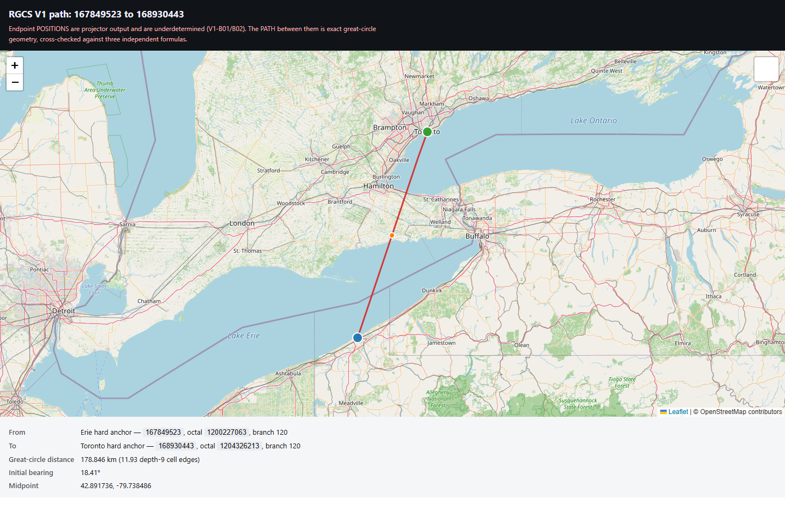
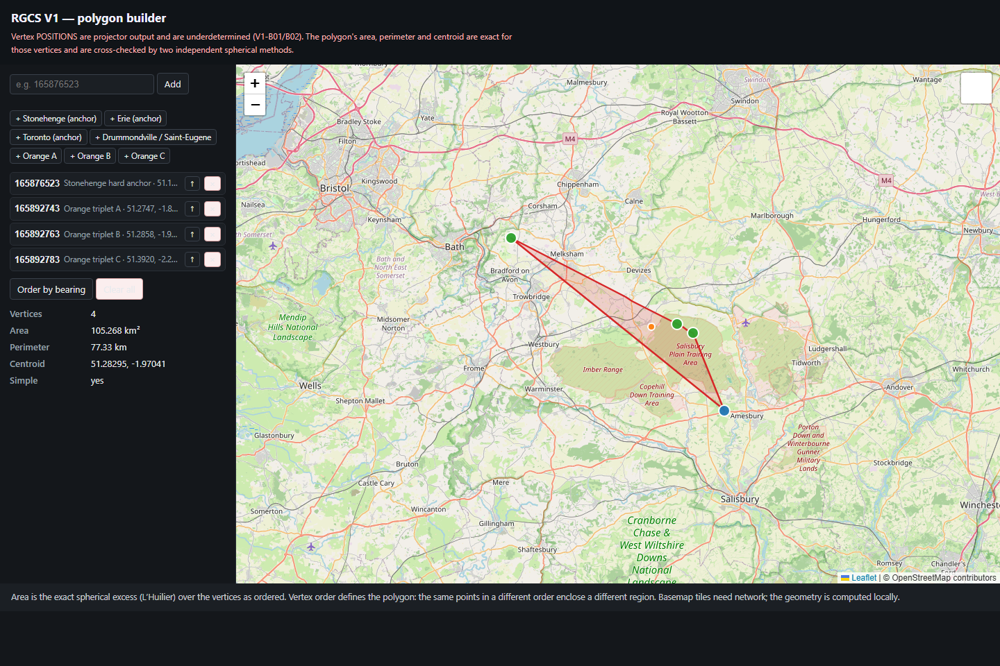
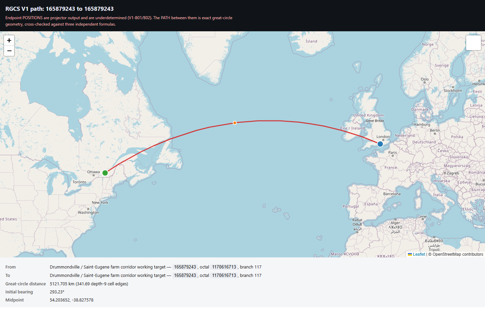

# RGCS — Resonant Geometry Computational System

[](https://github.com/andrew867/rgcs/actions/workflows/ci.yml)
[](LICENSE)
[](https://doi.org/10.5281/zenodo.21387947)

An evidence-governed research programme in resonant geometry: crystal and resonator
physics, typed coordinate systems, signal and phase analysis, and the provenance
machinery that keeps them honest.

> **Lore proposes. Mathematics translates. Software attacks. Evidence decides.
> Provenance remains.**

That sentence is the architecture, not a slogan. Every lane below takes a claim,
translates it into something computable, attacks it with tests, and records the verdict
— including when the verdict is *no*. **Most physical claims in this repository have
been refused or left unmeasured, and those results are published beside the positive
ones.**

---

## Pick your entry point

| I want to… | Go here |
|---|---|
| See something work in 60 seconds | [Map workbench](#map-workbench) ↓ |
| Validate a crystal, design parts, export build sheets | [RGCS Design Studio](#rgcs-design-studio) ↓ |
| Model a crystal specimen | [Crystal & resonator lane](#crystal--resonator-physics) ↓ |
| Understand the typed maths core | [Foundations](#foundations) ↓ |
| Browse everything | **[Documentation index](docs/README.md)** |
| Know what's proven and what isn't | [Claim boundaries](docs/CLAIM_BOUNDARIES.md) |

---

## The lanes

### Foundations

The typed, deterministic mathematics everything else is built on.

| package | what it is |
|---|---|
| `rgcs_core` | RGCS v2 computational core — deterministic, typed, tested implementation of the v2 mathematical model |
| `rscs_core` | RSCS 1.0 — typed coordinate/state-space foundation: periodic phase ambiguity, nested frames, uncertainty, provenance |
| `rscs2_core` | RSCS 2.0 — capability-aware multiphysics platform: anisotropic FEM, piezoelectric solver stack |

```bash
rgcs-v4 --help          # RSCS 2.0 multiphysics CLI
```

### Crystal & resonator physics

The lane the system is named for: resonant geometry in real materials.

| package | what it is |
|---|---|
| `r1013` | Custom crystal specimen workflow — schema, Christoffel API, FEM + convergence + piezo boundaries |
| `resonator_platform` | Closed-loop platform: design → simulate → fabricate → fixture → excite → measure → identify modes |
| `fkey_instrument` | Frequency-key harmonic excitation and the ESP32-CYD instrument |
| `rgcs_surface_wave` | Phase-gated dielectric-loaded annular surface-wave research model |
| `r1015a` | Scale A mechanical crystal lane |

```bash
rgcs --help             # unified crystal workflow CLI
```

Guides: [Calibration](docs/CALIBRATION_GUIDE.md) ·
[Bench hardware](docs/BENCH_HARDWARE.md) ·
[Canonical 110 mm case study](docs/CANONICAL_110MM_CASE_STUDY.md)

### Coordinates & mapping

> RGCS is a coordinate, mapping, signal, and provenance research workbench. It converts
> received or user-supplied numeric vectors into reproducible binary/octal parse
> receipts, candidate Earth-root positions, great-circle paths, and polygonal map
> regions.

| package | what it is |
|---|---|
| `rgcs_coordinate` | Typed structural decoder/encoder for the 30-bit candidate codec |
| `cwatlas` | CW Atlas and bidirectional geocoder |
| `r1053` | **V1 Earth-root map workbench** — parse, path, polygon, live builder |

### Discovery & experiment architecture

| package | what it is |
|---|---|
| `r13` | Cross-domain discovery architecture: response functions, Green functions, S-matrices |
| `r15` | Experimental phase infrastructure — turns the R13 architecture instrument-ready and calibration-bound |

### Speculative lanes, explicitly gated

These exist so that speculative source material can be *attacked* rather than believed.
None of them is load-bearing for any established result.

| package | status |
|---|---|
| `cspc` | Crystalline Spacetime Coordinate Program — lore-derived, evidence-gated |
| `pmwr` | Phase memory / worldline multipath recovery / Phryll translation hypothesis |
| `consciousness_lane` | **Quarantined** under an explicit contract; isolated from every other lane |

---

## Map workbench

The most immediately demonstrable lane, and the newest.



```bash
python -m pip install -e .
python -m r1053 parse   168930443
python -m r1053 map     168930443
python -m r1053 path    167849523 168930443
python -m r1053 polygon 165876523,165892743,165892763,165892783
python -m r1053 serve
```

```
distance        178.846 km (11.93 depth-9 cell edges)
initial bearing 18.41 deg
midpoint        42.891736, -79.738486
cross-check     3 formulas agree: True (spread 2.67e-11 km)
```

**The polygon builder** takes any number of vectors — type one and press Add, paste a
comma-separated list, Remove any row, reorder, or hit *Order by bearing*. Area,
perimeter, centroid and the self-intersection check recompute on every edit.



→ [Quickstart](docs/QUICKSTART.md) · [User Manual](docs/USER_MANUAL.md) ·
[Map/Path/Polygon Guide](docs/MAP_PATH_POLYGON_GUIDE.md)

### What this lane will not tell you



*One vector. One octal word `1170616713`. One branch. Two positions 5121.7 km apart —
both fitting all three calibration anchors to machine precision.*

The projector matrix is scale-invariant: 9 entries, **8 free parameters**, fitted
against **6 constraints** from 3 anchors. A 2-dimensional family survives, and two of
its members put the same vector on different continents. **A zero anchor residual is
arithmetic, not evidence.**

```text
Vertex POSITIONS are projector output and remain underdetermined under V1-B01/B02.

Path, polygon, distance, perimeter, centroid, and area geometry are exact for the
selected vertices.

The tool verifies geometry.
It does not verify that a candidate vertex is physically true.
```

Open blockers **B01–B07**, stated in full with the numbers that make them real:
**[docs/BLOCKERS_B01_B07.md](docs/BLOCKERS_B01_B07.md)** — pinning irreproducibility
(B01), three anchors cannot test an eight-parameter law (B02), the branch-117 conflict
(B03), the cell-scale n=1 reading (B04), no coastline data (B05), the Saint-Frédéric
proxy (B06), no transport bridge (B07).

---

## Applications

| command | what it opens |
|---|---|
| `rgcs-lab serve` | Local web hub — nine inspectable modules, each with receipts and claim badges. Loopback, no telemetry. |
| `rgcs-workbench` | PySide6 desktop research workbench |
| `rgcs-workbook` | Workbook / reporting CLI |
| `rgcs-coordinate` | Coordinate codec CLI |
| `python -m r1053` | Map workbench CLI |

---

## RGCS Design Studio

The desktop workbench (`rgcs-workbench`) has two modes:

| Mode | Use it for |
|---|---|
| **Design Studio** | guided crystal validation, certification sheets, printable Phyrll generator templates, coil/pulse design, annular ring prototype design |
| **Advanced Scientific Workbench** | source library, specimen/model editors, experiment builder, comparison views, reports and bundles |

### Start by task

| I want to… | Open | Output |
|---|---|---|
| Validate a crystal | Crystal Validator | geometry receipt, derived values, certification PDF |
| Generate printable parts | Phyrll Generator Designer | SCAD, STL (when OpenSCAD is installed), build PDF, receipt JSON |
| Design coils and pulses | Coil / Pulse Designer | wire estimates, pulse table, sidebands, build PDF |
| Design an annular ring | Annular Ring Designer | ring diagram, masks, SVG/SCAD, engineering PDF |
| Use frequency keys | Frequency Key Library | sourced key list, sidebands, key relations |
| Inspect the research model | Advanced Scientific Workbench | models, sources, experiments, reports, bundles |

Install and launch:

```bash
python -m pip install -e ".[desktop]"
rgcs-workbench
```

Guides: [INSTALL.md](INSTALL.md) ·
[Design Studio](docs/user/DESIGN_STUDIO.md) ·
[Crystal Validator](docs/user/CRYSTAL_VALIDATOR.md) ·
[Phyrll Generator Designer](docs/user/PHYRLL_GENERATOR_DESIGNER.md) ·
[Coil / Pulse Designer](docs/user/COIL_PULSE_DESIGNER.md) ·
[Annular Ring Designer](docs/user/ANNULAR_RING_DESIGNER.md)

Every exported sheet carries a claim boundary: designs and estimates are model
outputs and reproducibility records — they do not by themselves validate any
anomalous physical effect. Measurements decide.

---

## What this project does not claim

**RGCS does not claim that anomalous sources, craft, crop formations, physical
propulsion, or non-human communication are proven.**

The longer form, emitted by the software itself as `r1053.certificate.CLAIM_BOUNDARY`:

> RGCS V1 is a coordinate/research workbench with a candidate Earth-root projection. It can parse and emit structured vector receipts, reproduce the V1 calibration artifacts, and classify residuals under declared cell-scale and operational-envelope hypotheses. It does not prove physical craft, alien sources, crop-circle authorship, Phryll propulsion, or metric engineering.

Two more, at the root of the repository:
[SCIENTIFIC_BOUNDARIES.md](SCIENTIFIC_BOUNDARIES.md) — what the project has **not**
established, with the measured evidence distribution — and
[NON_CLAIMS.md](NON_CLAIMS.md), everything not claimed, including claims withdrawn
after review.

### Published null results

Refusals are results. A sample of what has been recorded rather than buried:

| finding | class |
|---|---|
| 4096 Hz is **not** the electromagnetic surface-wave carrier — the annulus is electrically tiny there | NULL |
| Space-time nonreciprocity does **not** engage at 16 Hz modulation | NULL |
| A constructed harmonic field model **did not converge and was withdrawn** | NULL |
| An isolated distribution has zero self-force; no configuration produces unbalanced momentum | NULL |

Full ledger: [`negative_results/`](negative_results/)

### Two typed verdicts worth understanding

| result | verdict |
|---|---|
| Canonical 110 mm eye-node study | `UNCERTAINTY_OVERLAPS_CONVENTIONAL_NODE` — the candidate sits **3.906 mm** from the nearest conventional comparator and the uncertainty interval overlaps it. Not a distinct node. |
| Quartz mechanism firewall | `MECHANISM_NOT_IMPLEMENTED_FOR_MATERIAL` — a mechanism absent from the model is *not implemented*. That is a statement about software, never a claim of physical impossibility. |

*Not implemented* and *does not exist* are different claims. Only the first is ever
made here. The same rule governs every lore and provenance source — they may motivate a
test; they may never stand in for one.

---

## Documentation

**→ [Full documentation index](docs/README.md)** — every document, grouped by lane.

Fast paths:

| | |
|---|---|
| [Quickstart](docs/QUICKSTART.md) | clone to a working map in five minutes |
| [User Manual](docs/USER_MANUAL.md) | the map workbench, with real screenshots |
| [Architecture](docs/ARCHITECTURE.md) | how the packages fit together |
| [Claim Boundaries](docs/CLAIM_BOUNDARIES.md) | claim classes; what is and isn't established |
| [Claim Register](docs/CLAIM_REGISTER.md) | machine-lintable register — EST / DER / HYP / SRC / ENG |
| [Blockers B01–B07](docs/BLOCKERS_B01_B07.md) | the open problems, unsoftened |
| [Manuscripts](manuscripts/) · [Examples](examples/) | long-form treatments; runnable inputs |

Superseded documents live in [`docs/archive/`](docs/archive/) with correction banners.
They are never deleted.

---

## Tests

```bash
pytest -q                                    # everything
pytest tests/test_r1053_v1.py -q             # map workbench
```

The suite asserts the boundaries, not just the behaviour: that fitted residuals are
labelled non-evidential, that nulls travel with the claims they qualify, that no
document asserts proof, and that every blocker keeps its detail and clearing condition.

**Verification status at v8.4.0 (Design Studio):** 8362 passed, 9 skipped,
1 deselected, exit 0.

**Verification status at the frozen v8.3.0 release commit:**
**8129 tests passed**, 15 skipped, 1 deselected, exit 0 (`expect: 8129 passed`);
proof-bundle checksums **115/115** via `rgcs-v4 verify-checksums`. Counts derive from a
real pytest run recorded in `docs/v4/RELEASE_METADATA.json` — a document that drifts
from the recorded number fails the build.

The one deselected node is
`tests/regression/test_generator_determinism.py::test_generator_deterministic`, a
byte-equality check requiring the archived v2.0.0 build environment. Hosted CI
deselects exactly that node id under policy **D-V3-04**. It is the only known
environment-dependent test in the repository.

---

## Release status

```text
current release:   v8.4.0 — RGCS Design Studio v1
workbench RCs:     workbench-v1.0.0-rc1 / -rc2 (pre-releases, shipped)
```

Current release: [v8.4.0](https://github.com/andrew867/rgcs/releases/tag/v8.4.0).
Frozen history — v2.0.0 (`archive/v2.0.0/`), v3.0.x, v4.0.0, v4.1.x — tags and records
are never modified. The DOI badge is the latest **minted** DOI (v3.0.1).

The pending candidate publishes the map workbench as **software, not proof**.

---

MIT licensed · Author: Andrew Green · Citing: [CITATION.cff](CITATION.cff)
