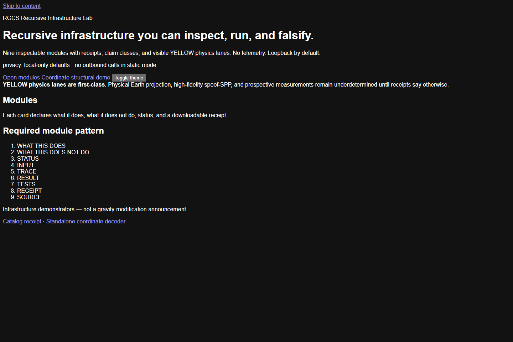
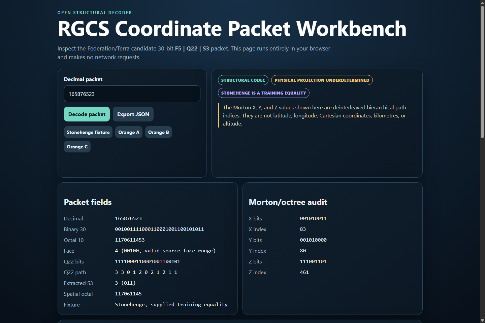
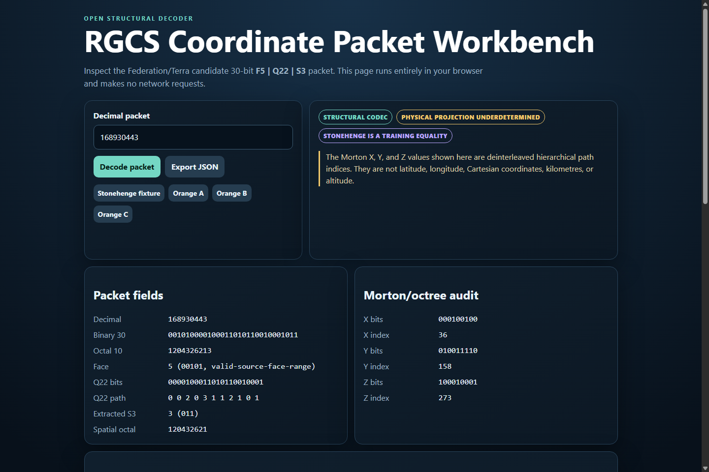
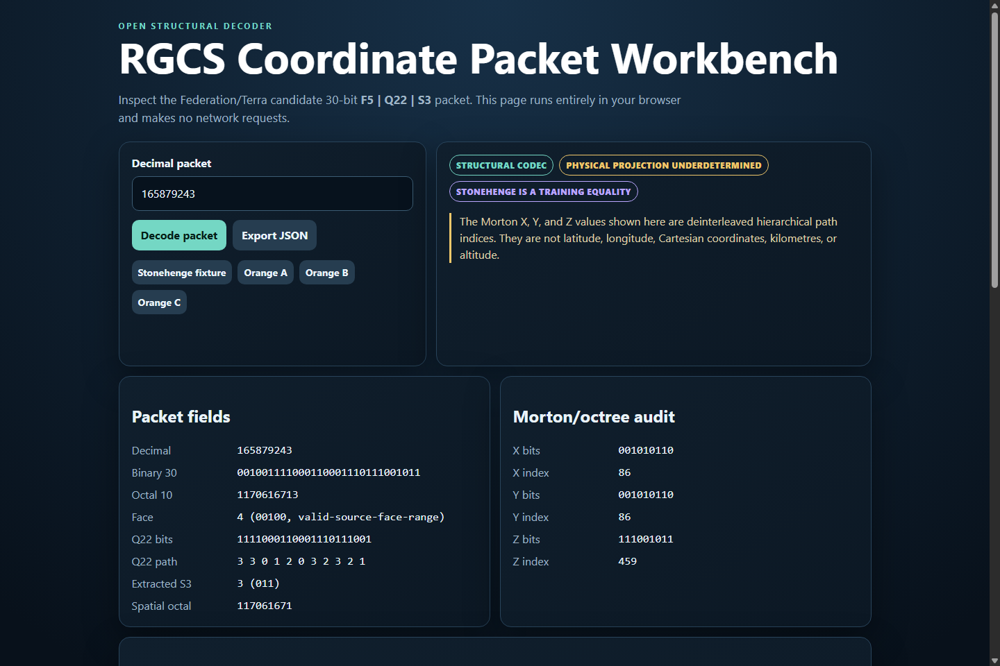
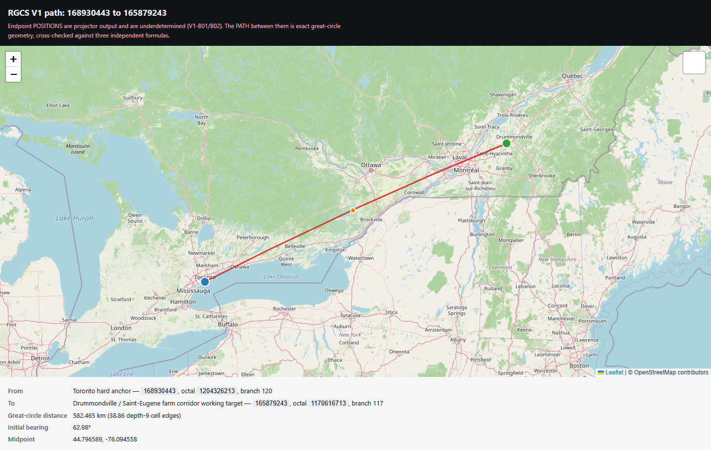
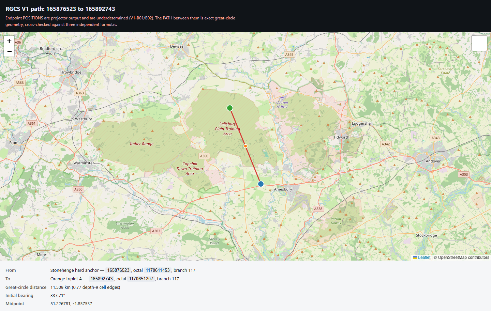
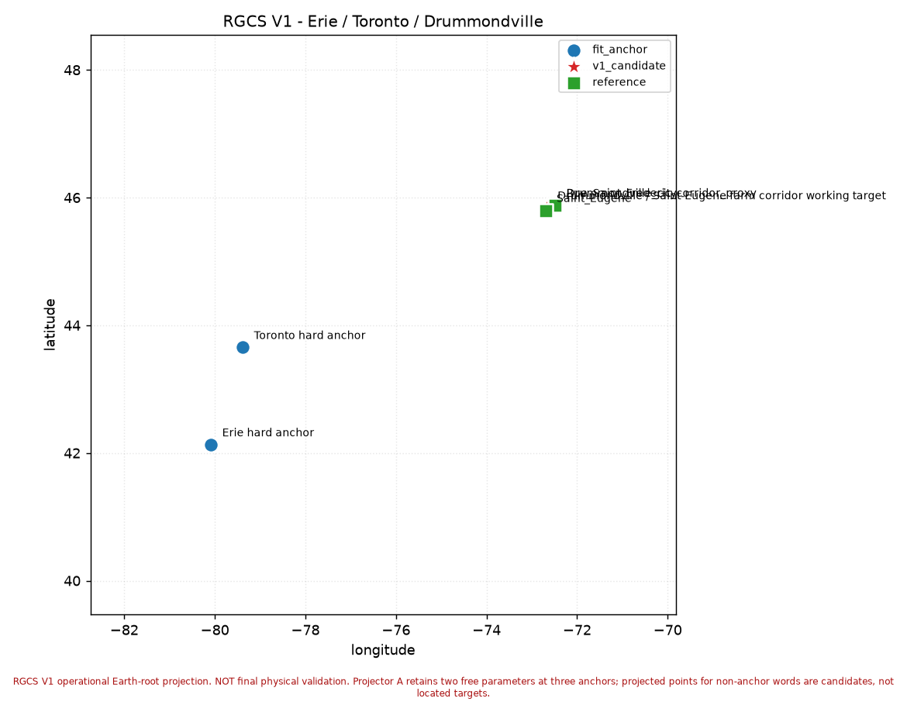
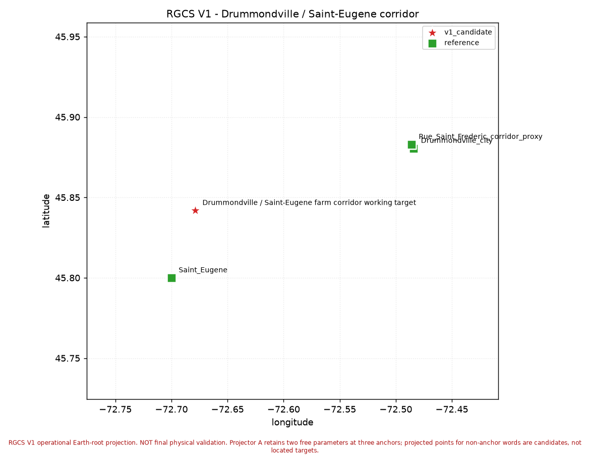
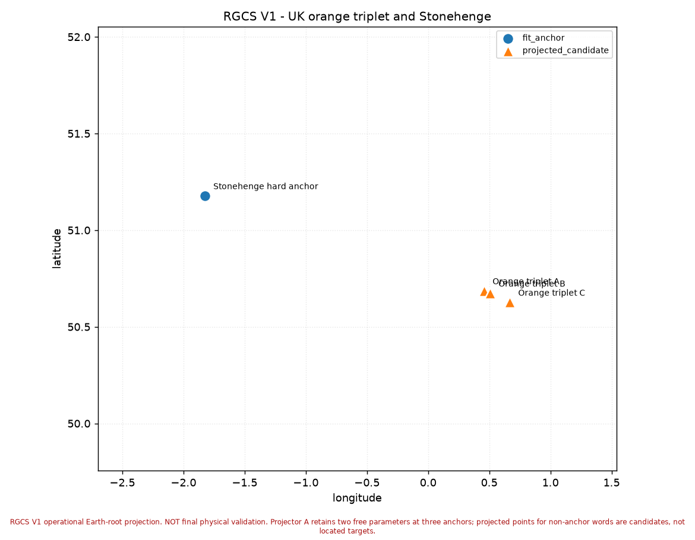

# RGCS V1 — User Manual

> RGCS V1 is a coordinate/research workbench with a candidate Earth-root projection. It can parse and emit structured vector receipts, reproduce the V1 calibration artifacts, and classify residuals under declared cell-scale and operational-envelope hypotheses. It does not prove physical craft, alien sources, crop-circle authorship, Phryll propulsion, or metric engineering.

Every screenshot in this manual was captured from a real run of this repository at
commit `3aba308`. None are mock-ups. Provenance for each is in
[§8 Screenshot inventory](#8-screenshot-inventory) and in
[`assets/user-manual/SCREENSHOT_INVENTORY.json`](assets/user-manual/SCREENSHOT_INVENTORY.json).

---

## 1. Install and check

```bash
python -m pip install -e .
```

Verify the install and privacy defaults:

```bash
rgcs-lab doctor
```

Real output:

```
RGCS Recursive Infrastructure Lab 0.1.0.dev0
privacy: host=127.0.0.1 telemetry=False outbound=False
         no private operator transcripts in public builds
modules: coordinate, golay, frames, memory, dual_pole,
         lattice, metasurface, predictions, proofs
coordinate: {'module': 'coordinate', 'codecs': [{'codec_id': 'federation-terra-30',
  'wire_radix': 10, 'word_bits': 30, 'layout': 'F5 | Q22 | S3',
  'status': 'STRUCTURAL_GREEN', 'physical_projection': 'UNDERDETERMINED'}],
  'standing': 'PHYSICAL_PROJECTION_UNDERDETERMINED'}
```

Note `outbound=False` and `host=127.0.0.1`: the workbench is loopback-only by default
and makes no network calls.

---

## 2. Start the workbench

```bash
rgcs-lab serve --host 127.0.0.1 --port 8787
```

Open <http://127.0.0.1:8787/>.



The hub lists nine modules. Each card declares **what it does**, **what it does not
do**, its status, and a downloadable receipt. The YELLOW banner is deliberate: physical
Earth projection is underdetermined and the UI says so on the front page.

---

## 3. Decode a vector

Click **Coordinate structural demo**, or go to <http://127.0.0.1:8787/workbench>.

### 3.1 A fit anchor — `165876523` (Stonehenge)



| field | value |
|---|---|
| Binary 30 | `001001111000110001001100101011` |
| Octal 10 | `1170611453` |
| Face | 4 (`00100`, valid-source-face-range) |
| Q22 path | `3 3 0 1 2 0 2 1 2 1 1` |
| Extracted S3 | 3 (`011`) |
| Spatial octal | `117061145` |

The badges read **STRUCTURAL CODEC**, **PHYSICAL PROJECTION UNDERDETERMINED**, and
**STONEHENGE IS A TRAINING EQUALITY**. That third badge matters: Stonehenge is one of
the three anchors that *define* the projector, so its residual is arithmetic, not
confirmation.

The page also warns that Morton X/Y/Z are **deinterleaved hierarchical path indices —
not latitude, longitude, Cartesian coordinates, kilometres, or altitude.**

### 3.2 A second anchor — `168930443` (Toronto)



Toronto's octal begins `120` — the **North American** branch. Stonehenge begins `117`
— the **British** branch. This partition holds across the labelled corpus with no
crossovers, and it is the sharpest structural result in the programme.

### 3.3 The relabelled word — `165879243`



| field | value |
|---|---|
| Binary 30 | `001001111000110001110111001011` |
| Octal 10 | `1170616713` |
| Face | 4 |
| Q22 path | `3 3 0 1 2 0 3 2 3 2 1` |
| Spatial octal | `117061671` |

**Active label:** `Drummondville / Saint-Eugène farm corridor working target`
**Retired label:** `Montreal` → `HINT_PROVENANCE_ONLY`, `may_fit_projector = False`

Note the octal branch is **117 — British** — while the working label is in Quebec.
That contradiction is blocker **B03** and is *not* resolved by the relabel. See
[§7](#7-blockers).

### 3.4 From the command line

```bash
rgcs-lab coordinate decode 165879243
```

```json
{
  "module": "coordinate",
  "status": "GREEN",
  "claim_class": ["EXACT_ARITHMETIC", "TRAINING_EQUALITY", "UNDERDETERMINED"],
  "input": {"raw_decimal": "165879243"},
  "models": ["federation-terra-30"],
  "result": {
    "schema": "rgcs.structural-trace.v1",
    "width_bits": 30,
    "binary30": "001001111000110001110111001011",
    "octal10": "1170616713",
    "packet_family": "federation-terra-f5-q22-s3-candidate",
    "face_id": 4,
    "face_status": "valid-source-face-range"
  }
}
```

---

## 4. Address certificates

A bare `lat, lon` carries no frame, so RGCS emits typed certificates instead:

```python
from r1053 import certificate
cert = certificate.address_certificate(165879243)
```

Every certificate carries the wire, the field cut, the **frame manifest** (Earth root
D_V1, centre, axes, South-Up convention, datum, epoch gating), the projection with its
pinning rule, the label with its retirement history, the claim class, and the blockers
that bear on it.

```json
{
  "claim_class": ["STRUCTURAL_PARSE_EXACT", "PROJECTION_UNDERDETERMINED",
                  "CANDIDATE_NOT_LOCATED_TARGET"],
  "blockers": ["V1-B01", "V1-B02", "V1-B03", "V1-B04", "V1-B05", "V1-B06"],
  "projection": {
    "v1_pinned_lat": 50.8494, "v1_pinned_lon": -0.9022,
    "operator_supplied_lat": 45.8418969, "operator_supplied_lon": -72.6788251,
    "pinning_gap_km": 5121.7,
    "is_located_target": false
  }
}
```

That `pinning_gap_km` of 5121.7 is not a bug. Two members of the same free family fit
all three anchors exactly and disagree about which **continent** this word addresses.
See [§7 B01](#7-blockers).

Export the full bundle:

```python
import json
from r1053 import certificate
json.dump(certificate.receipt_bundle(), open("receipt_bundle.json", "w"), indent=2)
```

---

## 5. Wide-envelope records are refused

```python
from r1053 import certificate
certificate.envelope_rejection("1687293589323")
```

```json
{
  "record": "1687293589323", "digits": 13, "bits": 41,
  "direct_lane_max_bits": 30, "admitted": false,
  "reason": "exceeds the 30-bit direct word; wide-envelope records require a transport bridge",
  "bridge_status": "REFUTED_AS_GENERAL_TRANSPORT_BRIDGE",
  "blocker": "V1-B07", "never_truncated": true
}
```

All seven gated records (34–41 bits) are **refused, never truncated**. Truncating to
30 bits would manufacture a false address.

---

## 6. Maps and residuals

The static maps below are matplotlib renders with no external dependency.

> **Leaflet is vendored locally** (`maps/vendor/`), so the map pages need no CDN.
> Basemap tiles are still fetched from OpenStreetMap / Esri and require network; if
> they fail the page shows a banner saying so rather than a blank pane. Serve the
> pages over loopback (`python -m r1053 serve-maps`) — a `file://` page cannot load
> the basemap.

### Two-vector paths — enter any two vectors

This is the check that matters: put in two vectors, get a real map with both
endpoints, the great-circle route between them, the midpoint, the distance and the
bearing.

```bash
python -m r1053 serve-maps            # loopback; needed so tiles can load
python -m r1053 path 167849523 168930443
```

```
from  167849523  42.129200, -80.085100   [FIT_ANCHOR_TARGET]  Erie hard anchor
      octal 1200227063  branch 120  face 19
to    168930443  43.653200, -79.383200   [FIT_ANCHOR_TARGET]  Toronto hard anchor
      octal 1204326213  branch 120  face 19

distance        178.846 km (11.93 depth-9 cell edges)
initial bearing 18.41 deg
midpoint        42.891736, -79.738486
cross-check     3 formulas agree: True (spread 2.67e-11 km)
```


Erie sits on the south-east shore of Lake Erie, Toronto on the north shore of Lake
Ontario, and the route crosses the Niagara peninsula. The distance agrees with the
recorded pack value of 178.847 km.

### Toronto → Drummondville, 582.465 km



The route runs Toronto → Kingston → Montréal → Drummondville, with the midpoint near
Brockville. Distance matches the recorded value of 582.4654 km.

### Stonehenge → Orange A, 11.509 km



Both words are in octal branch `117`, and under the V1 pinning both land in southern
England.

### B01, made visible

The same vector under two admissible pinnings of the same free family:

```bash
python -m r1053 path 165879243 165879243 --b-latlon 45.8418969,-72.6788251
```


**One vector. One octal word `1170616713`. One branch `117`. Two positions 5121.7 km
apart** — one on the English south coast, one in Quebec — and both fit all three
anchors to machine precision.

This picture is the argument for blocker B01/B02 in a single image. The line between
the two points is exact. Which of the two points is right is exactly what three
anchors cannot tell you.

### What is verified and what is not

| question | status |
|---|---|
| Does the tool place two vectors on a real map and draw the path? | **verified** — screenshots above, real OpenStreetMap basemap |
| Is the great-circle distance correct? | **verified** — three independent formulas agree to < 1e-6 km; matches recorded pack values |
| Is the drawn line a true great circle? | **verified** — sampled midpoint is equidistant from both ends; segment lengths sum to the reported distance |
| Are the endpoints the right places? | **NOT verified** — projector output, underdetermined under B01/B02 |

The first three are properties of the software and are settled. The fourth is the
open scientific question, and no amount of correct line-drawing bears on it.

### Static offline maps

These are matplotlib renders needing no network.





| reference | distance | bearing | band |
|---|---|---|---|
| Saint-Eugène | 4.939 km | 019° | `LOCAL_HIT` |
| Rue Saint-Frédéric proxy | 15.615 km | 253° | adjacent cell |
| Drummondville city | 15.684 km | 254° WSW | adjacent cell |

15.684 / 14.989 = **1.046 depth-9 cell edges**. Read
[the 15 km model](RGCS_15KM_FIELD_ENVELOPE_MODEL.md) — including its null — before
quoting that.



## 7. Blockers

| id | severity | blocker |
|---|---|---|
| **B01** | structural | Pinning irreproducibility. The operator-supplied coordinates are not derivable from the law as stated; gaps 177–5122 km. |
| **B02** | structural | Three anchors cannot test a free projective law. 8 parameters vs 6 constraints; zero residual is guaranteed. **Five** anchors is the threshold. |
| **B03** | structural | `165879243` is in octal branch 117 (British) with a Quebec working label. |
| **B04** | evidential | Cell-scale reading is n = 1 against a six-rung ladder. |
| **B05** | operational | No coastline dataset; water acceptance cannot score. |
| **B06** | operational | Saint-Frédéric is a proxy **and** an observer location. |
| **B07** | structural | No transport bridge; the affine was refuted by a third labelled pair. |

---

## 8. Screenshot inventory

| file | captured | commit | operator@machine | bytes | sha256 (first 16) |
|---|---|---|---|---|---|
| `01_workbench_hub.png` | 2026-07-30 | `3aba308ae01c` | andrew@THINKDIFFERENT | 49,072 | `ab6903a0cf0128e2` |
| `02_decode_stonehenge_165876523.png` | 2026-07-30 | `3aba308ae01c` | andrew@THINKDIFFERENT | 542,938 | `35dcc91b8b8b395d` |
| `03_decode_toronto_168930443.png` | 2026-07-30 | `3aba308ae01c` | andrew@THINKDIFFERENT | 536,731 | `18dcb3fa4c8fc2be` |
| `04_decode_drummondville_165879243.png` | 2026-07-30 | `3aba308ae01c` | andrew@THINKDIFFERENT | 535,918 | `afbb2a3ccb64b475` |
| `06_path_erie_toronto.png` | 2026-07-30 | `3aba308ae01c` | andrew@THINKDIFFERENT | 1,095,589 | `7adecbb347df6724` |
| `07_path_toronto_drummondville.png` | 2026-07-30 | `3aba308ae01c` | andrew@THINKDIFFERENT | 1,256,028 | `c7569b5dd0c5941d` |
| `08_path_B01_disagreement.png` | 2026-07-30 | `3aba308ae01c` | andrew@THINKDIFFERENT | 441,791 | `9268503ceeab632e` |
| `09_path_stonehenge_orangeA.png` | 2026-07-30 | `3aba308ae01c` | andrew@THINKDIFFERENT | 1,100,849 | `9e59a9fa4e3e87cc` |

Captured by `r1053.screenshots.capture` via QtWebEngine offscreen, driving the real
served page with JavaScript to enter each vector and press **Decode packet**. To
reproduce:

```bash
rgcs-lab serve --host 127.0.0.1 --port 8787
python -c "from r1053 import screenshots as S; import json; print(json.dumps(S.inventory(S.capture(S.manual_targets('http://127.0.0.1:8787/','internal-docs/RGCS_R10_53_V1_EARTH_ROOT/maps'),'out')),indent=2))"
```

A failed capture is recorded as a `FAILED` row with its exception and a
`SCREENSHOT_TODO` receipt. It is never replaced with an invented image.

---

## 9. Run the tests

```bash
pytest tests/test_r1053_v1.py tests/test_r1059_docs.py -q
```

```
28 passed in 6.47s
```

Full suite at the time of the R10.53 lock: **7937 passed, 1 failed, 15 skipped**. The
single failure is `tests/regression/test_generator_determinism.py::test_generator_deterministic`
— known float drift (D-V3-04) against an archived reference environment; the test's own
docstring records that hosted CI deselects that node id. It is unrelated to the
coordinate lane.

---

## 10. What this workbench will not tell you

It will not tell you that a vector *is* a place. Under three anchors the projector has
two free parameters, and two equally valid members of that family put `165879243` in
England and in Quebec. Until there are five independently sourced hard anchors, a
projected point is a **candidate**, and the manual, the receipts, the maps, and the
UI all say so in those words.
