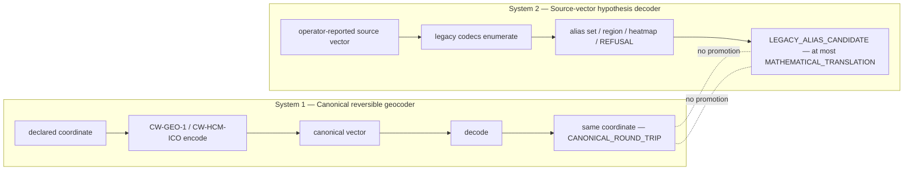

# CW Atlas — R10.8.1 Master Documentation and Manuscript

**Phase:** T08 / P62 (Master Documentation and Manuscript Update)
**Package:** `cwatlas` (built and tested on top of RGCS v8.0.0 / R15)
**Status:** COMPLETE — documentation phase, no code.

> **Terminal verdict (System Contract, § 2):**
> ```text
> RGCS_R10_8_1_GREEN_CW_ATLAS_READY
> CANONICAL_ROUND_TRIP_VERIFIED
> SOURCE_VECTOR_GEOGRAPHIC_SEMANTICS_NOT_CLAIMED
> PHYSICAL_VALIDATION_NOT_CLAIMED
> ```

---

## 1. What the CW Atlas is

The CW Atlas is a **bidirectional geocoder** for a family of coordinate vectors,
built as the Python package `cwatlas`. It does two clearly separated things:

1. **Canonical geocoding (map ⇄ vector).** A declared coordinate — a map or globe
   click on a named body, in a named frame, at a named epoch — is encoded to a
   versioned vector and decoded back to the same coordinate, exactly, within a
   declared quantization. This is an arithmetic, reversible transform over a
   *declared* convention.

2. **Legacy candidate decoding (vector → interpretations).** An
   operator-reported "source" vector string is run through a set of arithmetic
   codecs that enumerate the *possible* interpretations of the string. The result
   is zero, one, or many candidates — each with a score, a search-space count,
   and an uncertainty — **never a forced single location.**

The atlas exposes these through a small, typed API (the P57 backend service),
which the 2D MapLibre app (P58), the 3D CesiumJS globe (P59), and offline mode
(P60) all consume. The UI is specified in the companion `UI_SPEC_*` documents;
the browser frontend is delivered as spec, while the engine is built and tested
in `cwatlas/`.

## 2. The two-system firewall

The single most important design decision in the atlas is that these two systems
are **firewalled** from each other. They are implemented separately, claim-classed
separately, and no operation ever promotes a result from the second system into
the guarantees of the first.



| | **System 1 — Canonical geocoder** | **System 2 — Source-vector decoder** |
|---|---|---|
| Input | a **declared** coordinate | an **operator-reported** source vector |
| Codecs | `CW-GEO-1` (reversible geodetic), `CW-HCM-ICO` (icosahedral) | `CW-PACK40`, `CW-PACK38`, `CW-BASE100`, `CW-TRIPLET9`, `CW-SHELL9-LEGACY` |
| Output | exactly one point, or an explicit INVALID | zero / one / many candidates, or a refusal |
| Strongest claim | `CANONICAL_ROUND_TRIP` (a fact about the codec) | `MATHEMATICAL_TRANSLATION` (an arithmetic re-expression) |
| What it asserts about the world | **nothing** — arithmetic on a declared convention | **nothing** — an enumeration of possibilities |

The firewall is enforced in code, not just prose. `cwatlas/claims.py` refuses
the illegal promotion directly:
`claims.refuse_synthetic_codec_as_source_meaning()` raises if anyone argues that
a reversible round-trip in System 1 proves a source vector's meaning in System 2.

## 3. The required terminal verdict, line by line

- **`RGCS_R10_8_1_GREEN_CW_ATLAS_READY`** — the atlas package is built, tested,
  and reconciled with prior requirement lines (R10.8, R10.10, R14, R15; see
  `R10_8_1_RECONCILIATION.md`).
- **`CANONICAL_ROUND_TRIP_VERIFIED`** — System 1 encodes and decodes a declared
  coordinate back to itself within its declared quantization
  (`decode_canonical.decode_canonical` → `DecodeStatus.OK_POINT`,
  claim class `CANONICAL_ROUND_TRIP`).
- **`SOURCE_VECTOR_GEOGRAPHIC_SEMANTICS_NOT_CLAIMED`** — System 2 asserts no
  geographic meaning for any source vector; it yields alias sets or refusals.
- **`PHYSICAL_VALIDATION_NOT_CLAIMED`** — nothing in the atlas is a physical
  measurement; every `*_report()` in `cwatlas` re-asserts this.

## 4. Findings — what round-trips, and what stays alias-only

### 4.1 What round-trips exactly (System 1)

- **`CW-GEO-1`** — the direct reversible geodetic baseline. A declared
  `(body, frame, epoch, lat, lon, height, shell)` encodes to a vector with a
  checksum and decodes back to the same coordinate within the declared
  quantization floor. Verified in the pytest gate.
- **`CW-HCM-ICO`** — the icosahedral codec. A declared address encodes to a
  vector carrying a face, an octal path (one-to-eight recursive refinement to a
  declared depth), a residual, a shell/height record, and a checksum, and
  inverts back to the same address to full floating-point precision (the POWER
  property, `ico_vector`).

These are the **only** claims of exact recovery in the atlas, and they are claims
about the codecs, not about the world.

### 4.2 What stays alias-only or refuses (System 2)

- The legacy codecs (`CW-PACK40`, `CW-PACK38`, `CW-BASE100`, `CW-TRIPLET9`,
  `CW-SHELL9-LEGACY`) **enumerate** interpretations of a source string. A search
  returns `SearchStatus.OK_ALIAS_SET` (candidates with score, search space,
  uncertainty) or `SearchStatus.REFUSAL` (no codec admitted the string).
- A **single arithmetic candidate is not a pin.** Without a prospective
  calibration it renders as an **error region**, not a point
  (`vector_to_pin_ux.decide_pin_state` → `REGION`), because an exact point would
  invent precision the data do not support.
- `CW-SHELL9-LEGACY` is retained **only as a failed or conditional legacy codec**,
  as named history — not overwritten to make a newer model look inevitable.
- `NO_UNIQUE_GEOGRAPHIC_DECODE` is a **normal, successful result.** A refusal is
  an honest outcome, not a bug.
- The `CALIBRATED_MAPPING` claim class — the only class in which a source
  vector's semantics could ever be trusted — is **evidence-gated** and is
  **not reachable** without a prospective known-destination challenge
  (`claims.EVIDENCE_GATED_CLASSES`). No such calibration has been earned.

## 5. Non-claims — and where each is refused in code

Every non-claim below maps to a specific refusal in `cwatlas/claims.py` (and its
callers). This is the heart of the manuscript: the boundary is not an aspiration,
it is executable.

| # | Non-claim (what the atlas does **not** say) | Refusal in code |
|---|---------------------------------------------|-----------------|
| 1 | A source vector does **not** identify a real location (geographic or extraterrestrial). It yields an alias set or a refusal, never a decoded destination. | `claims.refuse_source_as_geographic` (also `decode_legacy.refuse_source_as_location`) |
| 2 | **Stonehenge**, or any other named site, has **not** been decoded from the vector family. An arithmetic proximity is not a decode. | `claims.refuse_site_decoded` |
| 3 | The coordinate system does **not** control gravity, portals, craft, or consciousness. | `claims.refuse_control_claim` |
| 4 | A close arithmetic match does **not** establish intended encoding. Coincidence is not authorship. | `claims.refuse_close_match_as_intent` |
| 5 | A public patent does **not** validate a secret craft programme. A patent is a document. | `claims.refuse_patent_as_craft_validation` |
| 6 | A legacy alias set may **not** be forced to a single pin. | `claims.refuse_alias_as_unique` |
| 7 | A reversible canonical round-trip (System 1) does **not** prove a source vector's meaning (System 2). | `claims.refuse_synthetic_codec_as_source_meaning` |
| 8 | A map pin may **not** be produced without a declared CRS and an epoch receipt. | `claims.refuse_pin_without_crs_epoch` |

Additional nonliteral guards elsewhere in the package:

- Shell labels (`SHELL_0_SURFACE_DATUM` … `SHELL_8_OUTER_BAND`), radial band
  ordinals, and `EFFECTIVE_POTENTIAL_ORDINAL_{i}` labels are **nonliteral SOURCE
  ontology**, not measured altitudes or physical potentials
  (`radial.refuse_effective_potential_as_physical`).
- The 8 ⇄ 0 shell closure is source ontology and is **never auto-applied**
  (`shells.refuse_auto_closure`; opt-in only via `apply_shell_closure`).
- An error region collapsed to a zero-area point without justification is refused
  (`uncertainty.refuse_invented_precision`).

The red-team index `claims.FORBIDDEN_PROMOTIONS` gathers these refusals so a test
can assert each one raises.

## 6. Claim taxonomy (the ladder)

From `cwatlas/claims.py` (`ClaimClass`), strongest guarantee to weakest, with the
gate between them:

```text
CANONICAL_ROUND_TRIP        — a fact about a reversible codec (System 1)
MATHEMATICAL_TRANSLATION    — an arithmetic re-expression; no meaning asserted
LEGACY_ALIAS_CANDIDATE      — one admissible decode among a set, with score
SOURCE_CLAIM                — a value/interpretation reported by a source
OPERATOR_HYPOTHESIS         — a hypothesis proposed by the operator
CALIBRATED_MAPPING          — survives a prospective challenge  [EVIDENCE-GATED]
REFUSAL                     — declined for missing calibration / CRS / epoch
```

`MAX_SOURCE_CLASS = MATHEMATICAL_TRANSLATION`: the strongest class a
*source-reported* vector can reach without prospective evidence is an arithmetic
re-expression. `CALIBRATED_MAPPING` is unreachable from arithmetic alone.

## 7. Architecture and reproducibility

- **Bodies and frames** — `EARTH` (WGS84 / ITRF realizations / IAU body-fixed,
  ellipsoid `a = 6378137 m`) and `MARS` (`IAU_MARS_BODY_FIXED`,
  `a = 3396190 m`). No hidden default body or frame.
- **Every address is complete** — body, frame, epoch, horizontal and radial
  coordinate, shell state, local residual, codec id/version, checksum,
  uncertainty, provenance (System Contract invariant 2; Architecture Spec).
- **Geodesy is pure NumPy** — `pyproj` / GeographicLib are not installed; the
  engine avoids them, so a clean checkout reproduces results without heavy geo
  dependencies (see `receipts/P01.json`).
- **Privacy** — the private comms archive stays out of public version control;
  public fixtures are synthetic; private corpora load only through an ignored
  local path (`cwatlas/privacy.py`, `CWATLAS_PRIVATE_DIR`). Exports pass
  `export_separation.build_public_export` / `assert_export_clean`.
- **Reconciliation** — R10.8, R10.10, R14, and R15 are folded forward with
  explicit CARRIED / SUPERSEDED / CONTRADICTION-FLAGGED dispositions in
  `R10_8_1_RECONCILIATION.md`; three contradictions are flagged, not adopted.

## 8. UI companion documents

- `UI_SPEC_MAPLIBRE_WEB_APP.md` (P58) — the 2D MapLibre app: click → address →
  vector; paste → pin / alias set / region / heatmap / refusal; the P48 state
  machine; parameter controls; export.
- `UI_SPEC_3D_GLOBE_AND_SHELL_VIEWER.md` (P59) — the CesiumJS globe: Earth/Mars,
  shells 0..8, icosahedral faces and recursive cells, radial/shell and
  uncertainty overlays.
- `UI_SPEC_OFFLINE_AND_MAP_DATA.md` (P60) — offline mode, tile sourcing and
  licensing, and the no-telemetry / no-private-data-leaves-device boundary.

## 9. Unresolved questions

- Whether any source vector ever earns `CALIBRATED_MAPPING`. Answer today: **no**;
  it requires a prospective known-destination challenge (Workflow D) that has not
  been passed.
- Whether R14's evidence-ladder wording differs materially from R15's in any edge
  case not covered by the reconciliation (tracked; no coordinate impact).

## 10. Verdict

```text
RGCS_R10_8_1_GREEN_CW_ATLAS_READY
CANONICAL_ROUND_TRIP_VERIFIED
SOURCE_VECTOR_GEOGRAPHIC_SEMANTICS_NOT_CLAIMED
PHYSICAL_VALIDATION_NOT_CLAIMED
```

```text
GREEN_R10_8_1_P62_MASTER_DOCUMENTATION_AND_MANUSCRIPT_UPDATE
```
