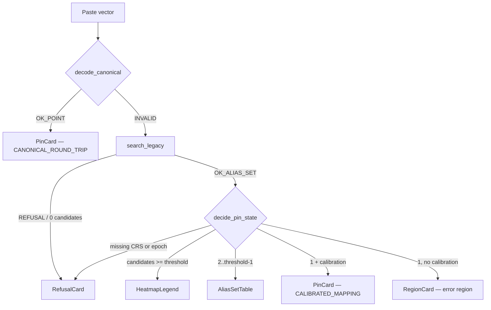

# UI Spec — CW Atlas 2D MapLibre Web Application (P58)

**Phase:** T08 / P58 (Application, Documentation, and Release)
**Status:** SPEC. The browser frontend (MapLibre / React) is **not** built in this
Python repository's pytest gate; it is delivered as a precise implementation
specification that a frontend developer builds against the P57 backend service
API. The backend engine it consumes is built and tested in `cwatlas/`.
**Depends on:** P57 (backend API and CLI), P48 (vector-to-pin UX state machine),
P36 (atlas parameters), P33/P34/P35 (map click, forward codecs), P38/P39 (export).

> `SOURCE_VECTOR_GEOGRAPHIC_SEMANTICS_NOT_CLAIMED`
> `PHYSICAL_VALIDATION_NOT_CLAIMED`

---

## 1. Scope and honest boundary

This document specifies the **two-dimensional map application**: a click on the
map produces a frame-and-epoch-certified address and vector; a pasted vector
produces a pin, an alias set, a region, a heatmap, or a refusal. It is a UI over
an engine that already exists and is tested. The document does **not** ship
browser code; it defines screens, state, controls, and the exact backend calls
each control makes so the two sides agree contract-for-contract.

Two non-negotiables shape every screen:

1. **A pin never appears without a declared CRS and epoch** (System Contract
   invariant 9). The engine refuses it (`claims.refuse_pin_without_crs_epoch`);
   the UI must never paper over that refusal with a default.
2. **A legacy vector is never forced to one pin** (invariant 4). One arithmetic
   candidate without calibration is a **region**, not a point
   (`vector_to_pin_ux.decide_pin_state`).

## 2. Recommended stack

```text
Language:   TypeScript (strict)
Framework:  React 18 + Vite
Map:        MapLibre GL JS (2D)
State:      a small typed store (e.g. Zustand or Redux Toolkit)
Transport:  fetch/JSON against the P57 service API
Styling:    CSS modules or Tailwind; no design system is mandated
```

The frontend holds **no** geodesy, codec, or claim logic of its own. Every
transform, decode, uncertainty, and refusal decision is a call to the P57
service, which wraps the tested `cwatlas` modules. The UI renders results and
receipts; it never invents them.

## 3. Backend service API (P57) consumed by this app

The P57 service is a thin JSON API over the tested `cwatlas` functions. Each
endpoint below names the underlying module function so the contract is exact.
Every response carries the receipt fields (`codec_id`, `frame`/`crs`, `epoch`,
`shell_state`, `uncertainty_m`, `claim_class`, `provenance`) — the UI displays
them, never strips them.

| UI action | Service endpoint (P57) | Underlying `cwatlas` call |
|-----------|------------------------|---------------------------|
| Enumerate selectable parameters | `GET /params` | `atlas_params.allowed_bodies/allowed_frames/allowed_shells/allowed_height_conventions/allowed_codecs/allowed_depths` |
| Validate a parameter set | `POST /params/validate` | `atlas_params.validate_params(...)` |
| Map click → address | `POST /address/from-click` | `map_to_address.map_click_to_address(...)` (direct) or `pixel_click_to_address(viewport, px, py, ...)` |
| Address → canonical vector | `POST /encode` | `address_to_vector.address_to_vector(...)` (CW-GEO-1) or `ico_vector.address_to_ico_vector(...)` (CW-HCM-ICO) |
| Decode canonical vector | `POST /decode/canonical` | `decode_canonical.decode_canonical(vector)` → `DecodeStatus.OK_POINT` \| `INVALID` |
| Decode legacy vector | `POST /decode/legacy` | `decode_legacy.search_legacy(raw)` → `SearchStatus.OK_ALIAS_SET` \| `REFUSAL` |
| Rank an alias set | *(within decode response)* | `alias_regions.rank_aliases(alias_set)` |
| Error region for one candidate | `POST /region` | `alias_regions.region_for_uncertainty(...)` → `uncertainty.propagate_circle` |
| Heatmap for an alias set | `POST /heatmap` | `alias_regions.alias_heatmap(ranked, center, ...)` |
| Choose the pin UX state | *(within decode response)* | `vector_to_pin_ux.decide_pin_state(candidate_count, calibration_available, crs, epoch)` |
| Build a CW URI | `POST /share/uri` | `share.format_cw_uri(CwUri(...))` |
| Parse a CW URI | `POST /share/parse` | `share.parse_cw_uri(text)` |
| Export a point batch | `POST /export/{geojson,kml,csv}` | `io_geo.to_geojson/to_kml/to_csv` |
| Import a point batch | `POST /import/{geojson,kml}` | `io_geo.parse_geojson/parse_kml` |

The UI must treat any `claim_class == "REFUSAL"` response as a **successful,
displayable state**, not an error toast.

## 4. Screen and component map

```text
AppShell
├── ParameterBar            (body / frame / epoch / shell / altitude / codec / depth)
├── MapCanvas               (MapLibre GL JS; click, pins, polygons, heatmap layers)
├── LeftPanel
│   ├── AddressPanel        (Workflow A result: geodetic/geocentric/ECEF/face/…)
│   └── VectorInputPanel    (Workflow B: paste vector, codec auto-detect, decode)
├── ResultPanel
│   ├── PinCard             (UNIQUE_POINT)
│   ├── AliasSetTable       (ALIAS_SET — candidates side by side)
│   ├── RegionCard          (REGION — one candidate, no calibration)
│   ├── HeatmapLegend       (HEATMAP — many candidates)
│   └── RefusalCard         (REFUSAL — the "why unavailable" UX)
├── ReceiptDrawer           (codec, frame, epoch, shell, uncertainty, provenance, checksum)
└── ExportBar               (GeoJSON / KML / CSV / CW URI)
```

## 5. ParameterBar controls (P36)

Populated from `GET /params`. No control has a hidden default; the selected
value is echoed into every receipt.

- **Body** — `EARTH` \| `MARS` (from `allowed_bodies`). Changing body reloads the
  allowed frames and re-fits the map projection to that body's ellipsoid.
- **Frame (CRS)** — from `allowed_frames(body)`: for `EARTH`, `WGS84`, the ITRF
  realizations, and `IAU_EARTH_BODY_FIXED`; for `MARS`, `IAU_MARS_BODY_FIXED`.
- **Epoch** — a decimal-year string (default `"2020.0"`, shown, never hidden).
- **Shell state** — `None` (unset) or `0..8` (from `allowed_shells`). Labels are
  the nonliteral SOURCE-ontology strings (`SHELL_0_SURFACE_DATUM` …
  `SHELL_8_OUTER_BAND`); the bar must render them as labels, not altitudes.
- **Altitude / height convention** — from `allowed_height_conventions`
  (e.g. `ELLIPSOIDAL`).
- **Codec** — `CW-GEO-1` (reversible geodetic baseline) or `CW-HCM-ICO`
  (icosahedral). Selecting `CW-HCM-ICO` reveals the **depth** control
  (`allowed_depths`); `CW-GEO-1` hides it.

The bar submits its full state to `POST /params/validate`; an invalid or
under-specified set returns a typed `ParamError` the UI shows inline. The
validated `AtlasParams` block is attached to every subsequent encode/decode call
so the receipt is complete.

## 6. Workflow A — click the map → vector

1. The operator sets body, frame, epoch, shell, altitude, and codec in the
   ParameterBar.
2. Click on the MapLibre canvas. The UI resolves the click to `(lat, lon)` in the
   map's declared projection and calls `POST /address/from-click`
   (`map_click_to_address` for a resolved geodetic click, or
   `pixel_click_to_address` with the declared `Viewport` extent for an
   equirectangular pixel click). **Uncertainty is required**: a direct click
   passes an explicit `uncertainty_m`; a pixel click lets the engine compute it
   from the pixel footprint. The UI never fabricates a precision.
3. The `AddressPanel` displays the returned `GeospatialAddress`: geodetic
   lat/lon, height, body, frame, epoch, shell state, coordinate convention, and
   uncertainty. Where the service also returns geocentric, ECEF, icosahedral
   face, barycentric path, and route-prefix fields, each is shown with its unit.
4. `POST /encode` produces the canonical vector, its checksum, and a CW URI
   (`share.format_cw_uri`). The vector, checksum, and full receipt appear in the
   `ReceiptDrawer`.
5. The operator copies the URI or exports via the `ExportBar`.

If the ParameterBar lacks a frame or epoch, the click endpoint returns a refusal
(`refuse_pin_without_crs_epoch`) and the UI shows the `RefusalCard` — it must not
place a marker.

## 7. Workflow B — paste vector → map (the P48 state machine)

The pasted string is **preserved verbatim**; the raw bytes are never mutated
(invariant 1). The UI shows candidate codec detection without rewriting the
input.

1. **Paste** the vector into `VectorInputPanel`.
2. The UI calls `POST /decode/canonical` first. On `DecodeStatus.OK_POINT` the
   result is a single `GeographicPoint` with a `CANONICAL_ROUND_TRIP` claim →
   `PinCard`. On `INVALID` (bad checksum / wrong version / malformed) the UI
   falls through to the legacy path; `INVALID` is a `REFUSAL`, not a crash.
3. `POST /decode/legacy` runs `search_legacy`. It returns
   `SearchStatus.OK_ALIAS_SET` (one or more candidates, each with score,
   search-space count, and uncertainty) or `SearchStatus.REFUSAL` (no codec
   admitted the string).
4. The service calls `decide_pin_state(candidate_count, calibration_available,
   crs, epoch)` and returns the `UxDecision`. The UI renders the matching
   component. The state precedence is fixed by the engine:

| PinState | Trigger | UI component | Claim class |
|----------|---------|--------------|-------------|
| `REFUSAL` | 0 candidates, **or** missing CRS/epoch | `RefusalCard` | `REFUSAL` |
| `HEATMAP` | candidates ≥ threshold (default 6) | `HeatmapLegend` + density layer | `LEGACY_ALIAS_CANDIDATE` |
| `ALIAS_SET` | 2 ≤ candidates < threshold | `AliasSetTable` (side by side) | `LEGACY_ALIAS_CANDIDATE` |
| `UNIQUE_POINT` | exactly 1 candidate **and** calibration available **and** CRS+epoch | `PinCard` | `CALIBRATED_MAPPING` |
| `REGION` | exactly 1 candidate, **no** calibration | `RegionCard` (error region) | `MATHEMATICAL_TRANSLATION` |

5. **Rendering per state:**
   - **UNIQUE_POINT** — a single marker plus its uncertainty circle. Only reachable
     when a prospective calibration exists; otherwise the flow lands in REGION.
   - **ALIAS_SET** — one polygon (or marker + region) per candidate, listed in the
     `AliasSetTable` with each candidate's assumptions, orientation profile,
     frame, epoch, score, and uncertainty. No candidate is highlighted as "the"
     answer.
   - **REGION** — one error region from `region_for_uncertainty` (a
     `uncertainty.propagate_circle` result: `RegionKind.CIRCLE`, with area,
     `combined_sigma_m`, `k_sigma`, `search_space_count`). No point marker.
   - **HEATMAP** — a weighted density layer from `alias_heatmap` (score-normalized
     circular cells). No forced pin.
   - **REFUSAL** — see §8.

`NO_UNIQUE_GEOGRAPHIC_DECODE` is a normal, successful result and must read as
one — never as a failure state.

## 8. Required "why unavailable" refusal UX

When the state is `REFUSAL`, or when a stronger state is blocked, the
`RefusalCard` must render the engine's own `why_unavailable` message verbatim
(`UxDecision.why_unavailable`, surfaced by `render_message`). It must not be a
generic error. The three canonical messages the engine emits:

- **No admissible decode** — "`NO_UNIQUE_GEOGRAPHIC_DECODE`: no admissible decode
  was produced. This is a normal, successful result, not a failure."
- **Missing CRS/epoch** — "A map pin may not be produced without a declared
  coordinate-reference-system and an epoch receipt (System Contract invariant 9)."
- **No calibration (single candidate)** — the calibration-unavailable message
  explaining that an exact point would invent precision, so an error region is
  shown instead, and that a prospective known-destination challenge is required
  to enable a point.

The card states, in plain terms, **which** stronger state was blocked and
**what** would unblock it. It offers no button that would force a pin.

## 9. Vector-to-pin state machine (rendered)



## 10. ReceiptDrawer

Every result exposes a full receipt (Architecture Spec + invariant 2): codec id
and version, namespace, body, frame (CRS), epoch, shell state, horizontal and
radial coordinates, local residual, checksum, uncertainty, claim class, and
provenance. Exact integer/symbolic forms are shown alongside displayed decimals.
The drawer is the single source of "what assumptions produced this" and is
copyable as JSON.

## 11. ExportBar

- **GeoJSON** — `POST /export/geojson` (`io_geo.to_geojson`, RFC 7946, CRS84,
  `[lon, lat, height?]`).
- **KML** — `POST /export/kml` (`io_geo.to_kml`, `<Placemark>/<Point>` with
  `lon,lat[,alt]`).
- **CSV** — `POST /export/csv` (`io_geo.to_csv`, explicit self-describing header).
- **CW URI** — copy `share.format_cw_uri(CwUri(namespace, codec, vector, frame,
  epoch))`: `cw://<namespace>/<codec>/<vector>?frame=<crs>&epoch=<epoch>`. The
  URI always carries the frame and epoch so a shared link never drops the pin's
  receipt.

Exports run through the privacy/export separation boundary
(`export_separation.build_public_export` / `assert_export_clean`): a label that
scans as private is refused before it can leave the app. All UI examples and
fixtures are synthetic.

## 12. Example (synthetic)

```text
ParameterBar:  body=EARTH  frame=ITRF2020  epoch=2020.0  shell=None
               altitude=ELLIPSOIDAL  codec=CW-GEO-1
Map click:     (lat +12.3400, lon +45.6700), uncertainty_m=25.0
→ /address/from-click → GeospatialAddress{...}
→ /encode (CW-GEO-1) → vector + checksum
→ /share/uri → cw://terra/CW-GEO-1/<percent-encoded-vector>?frame=ITRF2020&epoch=2020.0
```

(The coordinates above are an invented demonstration point, not a real or
private location.)

## 13. Non-claims (must hold in the UI)

- A pasted source/legacy vector does **not** identify a real location; it yields
  an alias set, a region, a heatmap, or a refusal — never a decoded destination.
- A single arithmetic candidate is **not** promoted to a pin without a
  prospective calibration.
- A close arithmetic match is **not** intent; the UI never labels a near match as
  "decoded".
- The reversible CW-GEO-1 round-trip is a property of the codec and says nothing
  about any operator-reported source vector.

## 14. Acceptance (spec-level)

- Every UI action maps to a named P57 endpoint and a tested `cwatlas` function.
- The P48 state machine is rendered exactly, with `REGION` (not a pin) for a
  single uncalibrated candidate and `REFUSAL` a first-class success state.
- No screen can produce a marker without a frame and epoch.
- Refusals render the engine's `why_unavailable` text verbatim.

```text
GREEN_R10_8_1_P58_MAPLIBRE_WEB_APPLICATION (SPEC)
```
