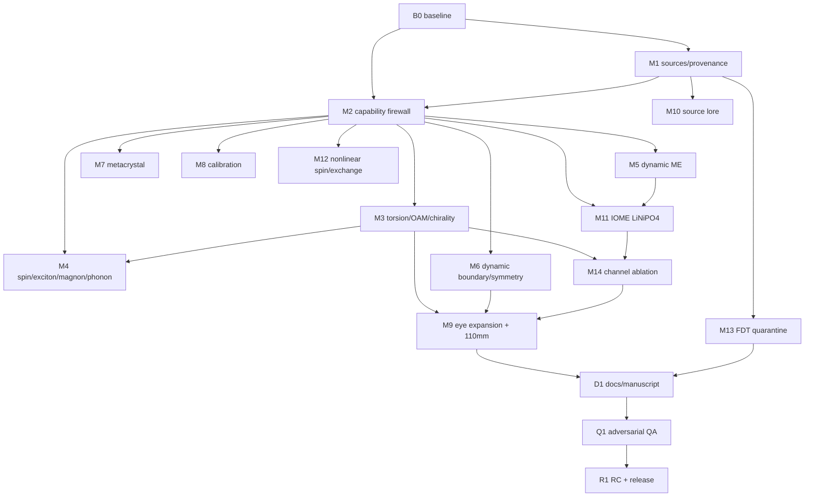

# V4 Agent Dependency Graph (Agent B0)

Machine-readable edge list: each edge is "consumer needs producer's
merged interfaces". Sequential execution order chosen (DV4C-004):

B0 → M1 → M2 → M3 → M4 → M5 → M6 → M7 → M8 → M11 → M12 → M13 → M14 →
M10 → M9 → D1 → Q1 → R1

This is a valid topological order of the graph above.

## Shared-file ownership (orchestrator-owned)

`docs/v4/V4C_DECISION_LOG.md`, master registries under
`docs/v4/registers/`, `pyproject.toml` version, `CHANGELOG`/release
notes, `.github/workflows/ci.yml`, final proof-bundle manifest, tags.
Agents write only inside their declared paths (each agent's run log
declares them) and hand shared edits to the orchestrator.
